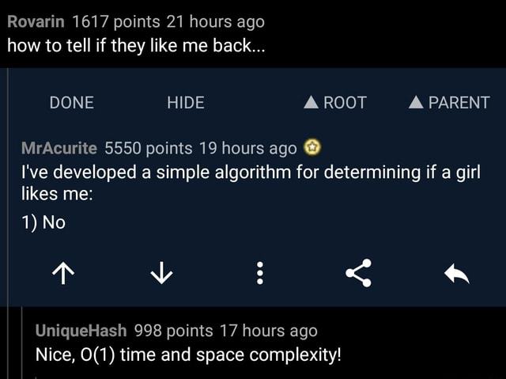
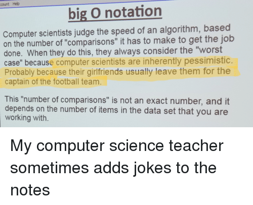
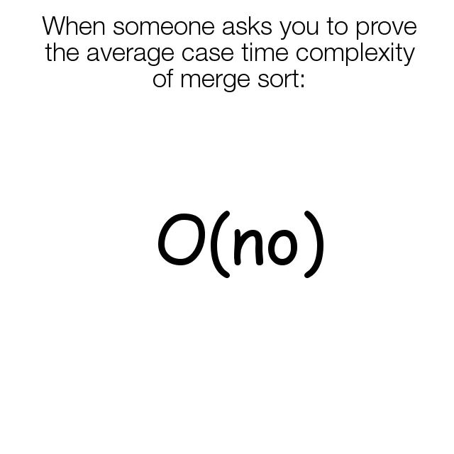

# Complexity Analysis

## Introduction

Computers can, in theory, compute anything given enough resources. However, in reality, we are bound by limited resources like memory and processing power. It is, thus, of paramount importance that we be able to write programs that are efficient for the given task. How do you design your program efficiently? The first step is to be able to analyze how much of an impact it causes on your resource pool. Once you know that, you get a starting point from whereon to optimize.

We shall begin with an example. Consider the problem of finding the sum of a given array of integers. In C++, a trivial solution is

```cpp
#include <iostream>
using namespace std;

int main()
{
    const int n = 10; // number of elements in our array
    int arr[n] = {1, 2, 3, 4, 5, 6, 7, 8, 9, 10};
    int sum = 0, i;

    for (i = 0; i < n; i++)
    {
        sum += arr[i]; // i.e. sum = sum + arr[i]
    }
    
    cout << sum;
    
    return 0;
}
```

Each statement in this program will take some small but finite time to run and each statement in this program will be executed only once *except* the statement `sum += arr[i]`. This particular statement is run $n$ times.

Now it's the time to do the complexity analysis. Let each statement take some time $c_k$ to run, where $k$ is as given in the comments of the program below

```cpp
#include <iostream>
using namespace std;

int main()
{
    const int n = 10; //............................ c1
    int arr[n] = {1, 2, 3, 4, 5, 6, 7, 8, 9, 10}; // c2
    int sum = 0, i; //.............................. c3

    for (i = 0; i < n; i++)
    {
        sum += arr[i]; //........................... c4
    }
    
    cout << sum; //................................. c5
    
    return 0; //.................................... c6
}
```

The total time taken for the program to run can be calculated as follows

$$T = c_1 + c_2 + c_3 + (c_4 \times n )+ c_5 + c_6$$

Note that the for-loop causes the time $c_4$ to be multiplied by $n$.

In practice the $c_k$ are very small, so for a very large $N$, we can write

$$T \approx c_4 n$$

This is often written in the big-O notation as

$$T = O(n)$$

The above statement means that the **runtime of the program depends linearly on** $n$. One also says that the above program is $O(n)$ or has time complexity $O(n)$.

A program which takes the same time to execute irrespective of the size of input is said to be $O(1)$.



## Techniques to find time complexity

Every program has a corresponding time complexity. You can also think of time complexity as something that quantifies how the runtime depends on the size of the input.

Recall the concept of RDS (rate determining step) from chemical kinetics. In a given series of reactions, RDS is the slowest step and hence the RDS determines the overall rate of the reaction series. Similar inference holds in algorithms. **The overall runtime of an algorithm is determined by its slowest parts.** The slowest parts are almost always loops (of all types: `for`, `while`, `do ... while`) or recursive functions. **Thus it is often enough to just look at the loops or recursive functions to determine the time complexity.**

Consider the following example which initializes a 2D array by setting all of its elements to 1.

```cpp
#include <iostream>
using namespace std;

int main()
{
    const int n = 3;
    int arr[n][n], i, j;

    for (i = 0; i < n; i++)
        for (j = 0; j < n; j++)
            arr[i][j] = 1;

    return 0;
}
```

Here the statement `arr[i][j] = 1` runs $n \times n = n^2$ times. Further, this is the only loop in this program, hence

$$T \approx cn^2 \implies T = O(n^2)$$

### More than one loop

What if there is more than one loop? The time complexity depends on the slowest one, and hence on that loop which runs the most number of times. The following program is $O(n^3)$.

```cpp
#include <iostream>
using namespace std;

int main()
{
    const int n = 42;
    int arr1[n], arr2[n][n], arr3[n][n][n], i, j, k;

    for (i = 0; i < n; i++)
        arr1[i] = 1;

    for (i = 0; i < n; i++)
        for (j = 0; j < n; j++)
            arr2[i][j] = 1;
    
    for (i = 0; i < n; i++)
        for (j = 0; j < n; j++)
            for (k = 0; k < n; k++)
                arr3[i][j][k] = 1;

    return 0;
}
```

Here is the way to calculate the time complexity, consider only the loops, hence

$$T \approx c_1 n + c_2 n^2 + c_3 n^3  $$

For a very large $n$, i.e. $n \rightarrow \infty$ only $n^3$ dominates. Hence

$$T \approx c_3 n^3 \implies T = O(n^3)$$

> Puzzle: **typeset in a box in the margin:** "How many instructions are executed when we multiply $n \times m$ matrix A with $m \times r$ matrix B?" Answer: $c\times mnr$, where $c$ is some constant.

### Best, average and worst case complexity

We have seen that the runtime of a program depends on the input it is given. It is then natural to ask if there are inputs for which the program takes the shortest time to run. Such inputs are called the best case and have their own time complexity called best case complexity. The performance of the algorithm given an average input is characterized by average case complexity. There also exists a worst case complexity. In such cases, the program gets the worst possible input and hence takes the longest possible time. For example consider a program which sorts a given array. The worst possible input for this program is an array which is *sorted in reverse order.*



Consider the following program which finds if a given number is prime

```cpp
#include <iostream>
using namespace std;

int main()
{
    int n, i;
    bool is_prime = true;
    cin >> n;

    for (i = 2; i < n; i++)
    {
        if (n%i == 0)
        {
            is_prime = false;
            break;
        }
    }

    if (is_prime == true)
        cout << "Prime" << endl;
    else
        cout << "Composite" << endl;
    
    return 0;
}
```

If this program is given an even number, the loop runs only once and this is the best case with best case complexity of $O(1)$. If given a prime number the loop runs $n-2$ times. Thus the worst case input is a prime number and the worst case time complexity is $O(n) \because T \approx c\times (n-2) = cn-2c \rightarrow cn$ as $n \rightarrow \infty$.

## Miscellaneous examples

Here we present a few problem statements with their solutions. We will analyze the time complexity for all of them.

### Finding primes

Consider the previous problem of finding if a number is prime. The following is ***different and valid*** solution

```cpp
#include <iostream>
using namespace std;

int main()
{
    int n, i;
    bool is_prime = true;
    cin >> n;

    // here is the change, we loop as long as i < sqrt(n)
    for (i = 2; i*i < n; i++)
    {
        if (n%i == 0)
        {
            is_prime = false;
            break;
        }
    }

    if (is_prime == true)
        cout << "Prime" << endl;
    else
        cout << "Composite" << endl;
    
    return 0;
}
```

Here the worst case input is again a prime number, wherein the loop runs for $\lfloor \sqrt{n}-1 \rfloor$ times ($\lfloor p\rfloor$ is the greatest integer just less than $p$). Hence the time complexity is $O(\sqrt{n})$. This algorithm is better than the previous one.

### Binary search

The problem statement is: given a **sorted** array, check if a given number is present in the array. One trivial way to do this is to run a for-loop and check each element of this array. This trivial solution is $O(n)$.

You have already seen a more efficient algorithm called binary search which uses recursion. The implementation is given below

```cpp
#include <iostream>
using namespace std;

int bsearch(int arr[], int x, int low, int high)
{
    if (high >= low)
    {
        int mid = low + (high - low) / 2;

        if (arr[mid] == x)
            return mid;
        else if (arr[mid] > x)
            return bsearch(arr, x, low, mid - 1);
        else
            return bsearch(arr, x, mid + 1, high);
    }

    return -1;
}

int main()
{
    int arr[] = {1, 2, 3, 4, 5, 6, 7, 8, 9, 10};
    int x = 4; // search for 4 in arr
    const int n = 10; // number of elements in the array
    
    int result = bsearch(arr, x, 0, n - 1);
    if (result == -1)
        cout << "Not found";
    else
        cout << "Element is found at index " << result;
    
    return 0;
}
```

Note that there is no loop here. So how do we calculate time complexity? The fundamental principle is the same. Look for that block of code where the program will spend most of its time. In this case it is the `bsearch` function. Thus in order to find the time complexity we have to calculate the number of times `bsearch` is called in the program, including all recursive calls.

Let `bsearch` be called $k$ times. In the worst case, each call leads to the division of the input array into two halves. This division continues until we have only one element left. Further, the initial length of the array was $n$. Hence

$$\frac{n}{2^k} = 1 \implies k = \log_{2}{n}$$

$$T \approx ck = c\log_2 n = O(\log_2 n)$$

Thus the time complexity of binary search is $O(\log_2 n)$.

Since $\log_2 n < n~\forall n \in \mathbb{N}$, binary search is more efficient than the trivial solution given in this section. 

You can watch a nice visualization of binary search at [https://www.youtube.com/watch?v=E6IOrZUpvSE](https://www.youtube.com/watch?v=E6IOrZUpvSE)

## Where next?

### Other time complexities

Algorithms with time complexities of $O(n\log_2 n)$, $O(2^n)$ and $O(n!)$ are also commonly found and you will study them later in this course.



### Choosing an algorithm

In a practical scenario, one uses an assortment of algorithms to achieve the desired result. It might seem that choosing each and every algorithm with the best "worst case complexity" is the logical thing to do, it is not so. Sometimes the input testcases can be so structured that using a worse "worst case complexity" algorithm can give a better time complexity overall. You will learn to apply the right algorithms with practice and experience.

### Additional problems

If you have done some basic algorithms, check out WnCC's excellent article on competitive coding  here: [https://github.com/wncc/CodeInQuarantine/tree/master/Week_2_CC](https://github.com/wncc/CodeInQuarantine/tree/master/Week_2_CC)

It contains many problems ordered by difficulty, try and apply the knowledge you have gained! 

### Further reading and references

1. [https://www.geeksforgeeks.org/understanding-time-complexity-simple-examples/](https://www.geeksforgeeks.org/understanding-time-complexity-simple-examples/)
2. [https://www.freecodecamp.org/news/time-complexity-of-algorithms/](https://www.freecodecamp.org/news/time-complexity-of-algorithms/)
3. [https://ocw.mit.edu/courses/electrical-engineering-and-computer-science/6-006-introduction-to-algorithms-fall-2011/lecture-videos/lecture-23-computational-complexity/](https://ocw.mit.edu/courses/electrical-engineering-and-computer-science/6-006-introduction-to-algorithms-fall-2011/lecture-videos/lecture-23-computational-complexity/)
4. [https://github.com/wncc/CodeInQuarantine/tree/master/Week_2_CC](https://github.com/wncc/CodeInQuarantine/tree/master/Week_2_CC)
