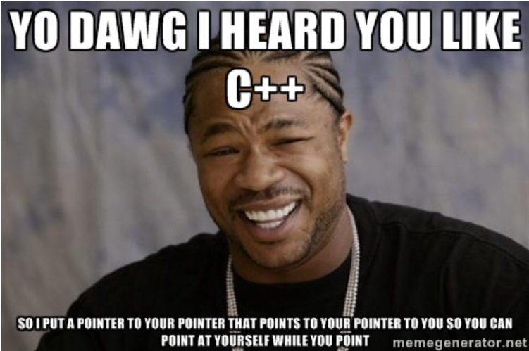

# Pointers, Structs

# Pointers and Structures

## What is a pointer and the `&` operator

We all know that all variables in our program are stored at some memory location. *A pointer is a variable which stores the address of another variable of the same data type.* We can also declare a null pointer which does not store the address of anything.  

The syntax to declare a pointer in C++ is :

`data_type* pointer_name;`

We then store addresses using “address of” operator (&). 

For example:

```cpp
int var = 10;
int* ptr; //this implies ptr is a pointer of type int
ptr = &var; //ptr is assigned the address of var
int* ptr_null = NULL; //ptr_null is a null pointer which points to no address
cout << "Address of var is " << ptr;
```

Output: `Address of var is 0x69fed4`

The address of `var` is printed, which is a hexadecimal (output may vary for you since it's an address). Since an `int` is of 4 bytes, the address of operator will print where the first byte of the `int` is stored

***Typeset the below question in a box in the margin:***

Ponder upon this: What will happen if we try to increment a pointer address. For example, if p is a pointer of type int what do you think will happen if we perform the operation p++? 

### Dereferencing Operator `*`

We can use the pointer to get the value of the variable it is pointing t as well, using the dereferencing operator(*) :

```cpp
int *ptr, var; // ptr is of type (int*) while var is of type int
var = 5;
ptr = &var;
cout << *ptr << " " << var; // using the * operator on pointer q.
```

Output: `5 5` 

`*ptr` is same as `var` which is equal to 5. Thus 5 is printed twice.

[Don't confuse the dereferencing operator with the * we use for initializing pointers(like `int*`). Dereferencing operators are used with a pointer variable like `ptr` and not with a data type like `int`.]

We can also change the value of the variable a pointer points to using * operator:

```cpp
int var = 5;
int* ptr = &var;
*ptr = 10; // value of p changed to 10
cout << var;
```

This prints out 10 which is the new value of `var`.

***Typeset the below question in a box in the margin:***

Try this question: Write a program to find out the greatest and the smallest among three numbers using pointers. Hint (use dereferencing operators).

### Passing by reference to functions

What if you want to change more than 1 variable you've passed as arguments to a function. What do you think will be the output of this program? 

```cpp
int func(int var1, int var2, int var3)
{
		var1 += 5;
		var2 += 5;
		var3 -= 5;
		return var3;
}

int main()
{
		int a = 12, b = 18, c = 21;
		c = func(a, b, c);
		cout << a << " " << b << " " << c << endl;
}
```

Output: `12 18 16`

As you can notice, the value of `a` and `b` remains the same even though they were changed in the function. This is called passing arguments to function by value. Since we can only return one `int` by this function, we can only change the value of one of the arguments passed.

What if you want to change the value of more than 1 arguments passed? This can be done in 2 ways-passing arguments by reference or passing pointers as arguments.

The idea of pass by reference is simple, any change in the parameters of the function will also be reflected in the corresponding argument. We declare a parameter as reference parameter by adding an & in front of its name. (Remember this `&` is different from the address of operator).             For example:

```cpp
int func(int &var1, int var2, int var3) // var1 is a reference parameter
{
		var1 += 5;
		var2 += 5;
		var3 -= 5;
		return var3;
}

int main()
{
		int a=12, b=18, c=21;
		c = func(a, b, c);
		cout << a << " " << b << " " << c << endl;
}
```

Output: `17 18 16`

The value of `a` was changed since it was passed by reference to `func` (notice the `&` before `var1`) and value of `b` remains unchanged.

You can think of a parameter whose argument is passed by value to be a dummy object which stores the initial value of the argument while a reference parameter to be the same object as that of its argument.

### Passing pointers to functions

Change in value of more than 1 argument passed to a function also be achieved by passing pointers as arguments. This is simply done by declaring the function parameter as a pointer type.

```cpp
int func(int *ptr1, int var2, int var3){ //ptr1 is a pointer of type int
	(*ptr1)+=5;
	var2+=5;
	var3-=5;
	return var3;
}
int main(){
	int a=12,b=18,c=21;
	c=func(&a,b,c); //address of a is passed as argument 
	cout<<a<<" "<<b<<" "<<c<<endl;
}
```

Output: 17 18 16

Suppose a is located at address 0x100. Now ptr1 stores this address when it is passed to the function. (*ptr1)+=5 increases the value of the int stored at 0x100 which is a itself and this change is reflected in the main function too. 

Note: A reference parameter does not have the same address as its argument but a pointer as a parameter will store the address of the argument. 

### Pointer to a pointer



Since pointers are also variables, they are also occupy some memory (4 bytes in a 32 bit system and 8 bytes in a 64 bit system). Therefore, it should be possible to have a pointer to store the address of another pointer. This is called a pointer to a pointer.                                                                                  For example, you can create a pointer to a pointer of type `int` by using `int** var_name`. 

Here's a fun puzzle to try on this concept:

```cpp
int var = 10;
int* ptr = &var;
int** ptr_to_ptr = &ptr;
(*ptr) += 5;
(**ptr_to_ptr) -= 5;
cout << var << endl;
```

Try predicting the output of the above code. Check your answer by typing this out yourself and running it on your laptop. 

Thus, pointers form the basics of any programming language and you'll come across them throughout the course.

Visit this link to learn more about pointers- [https://www.geeksforgeeks.org/pointers-c-examples/](https://www.geeksforgeeks.org/pointers-c-examples/)

## Structures

### What is a Struct and accessing elements

In C++, `struct` *is a data type which is used to group together variables of different data types and functions in a collection*. For example, you need to store the name and Roll No. of an IITB student together to access them easily in the future. We use the dot(.) operator to access struct members.

```cpp
struct student
{
		string name;
		int roll;

		void print_details() // this is a member function
		{
			cout << "Name: " << name << endl;
			cout << "Roll no: " << roll << endl;
		}
}; // notice the semicolon after closing bracket

int main()
{
		student s1; // declaring a struct variable 
		s1.name = "Subarno"; // accessing struct member
		s1.roll = 190010223;
		s1.print_details(); // accessing a member function
		student s2= {"Jash", 200050189};
		// This initializes struct members directly, name gets value "Jash" and roll gets 200030009
		s2.print_details();
}
```

Output:

```
Name: Subarno
Roll no: 190010223
Name: Jash
Roll no: 200050189
```

### Structs and Pointers

We could similarly create a pointer to a struct. We use to arrow operator (`->`) to access its members.

```cpp
struct student
{
		string name;
		int roll;
		void print_details()
		{ 
			cout<<"Name: "<<name<<endl;
			cout<<"Roll no: "<<roll<<endl;
		}
}; 

int main()
{
		student* s2= new student; // declaring a pointer to a struct
		s2->name = "Subarno"; // s2->name is same as (*s2).name 
		s2->roll = 190010223;
		s2->print_details();
}
```

Output:

```
Name: Subarno
Roll no: 190010223
```

### Constructors

In C++ (but **not** C), another useful feature of structs are constructors. A constructor is like a function having its name same as that of struct and not having a return type. It is generally used for initializing members of the struct. It is automatically called when a struct variable is initialized. For example:

```cpp
struct student
{
		string name;
		int roll;
		
		student(string s, int n) // constructor name same as that of struct
		{
				name=s;
				roll=n;
				cout << "Constructor called\n";
		}

		void print_details()
		{ 
				cout << "Name: " << name << endl;
				cout << "Roll no: " << roll << endl;
		}
}; 

int main()
{
		student s3("Subarno", 190010223); // we provide arguments to constructor while declaring struct variable
		s3.print_details();
}
```

Output: 

```
Constructor called
Name: Subarno
Roll no: 190010223
```

Moreover, we could create multiple constructors for a struct as long as they don't have same number and type of parameters. For example:

```cpp
struct MyStruct
{
		MyStruct()
		{
				cout<<"Constructor1 called\n";
		}

		MyStruct(int n)
		{ 
				cout<<"Constructor2 called\n";
		}
};

int main()
{
		MyStruct m1(); //this calls 1st constructor 
		MyStruct m2(10); //this calls 2nd constructor 
}
```

 Output: 

```
Constructor1 called
Constructor2 called
```

Thus, which constructor is called depends on what arguments we provide during initialization of struct variables. 

### Access Specifiers

In C++, you can also specify the type of access of struct members using access specifiers-public and private.  This is not possible in C as all the struct members are public and access cannot be changed. Public struct members can be accessed from outside the struct while private members cannot. All variables declared after an access specifier are of the type of that access specifier. For example:

```cpp
struct MyStruct
{
public:
		int a;
		int b;
private:
		int c;
};

int main()
{
		MyStruct m;
		m.a = 5;
		m.b = 10; // can access a and b from main(outside the struct) as they are public.
		m.c = 10; // this will generate a compilation error since c is a private member.
}
```

Thus, trying to access private members anywhere outside of the struct gives a compilation error.

Note: In a struct, all its members have public access by default. This means variables declared before the use of any access specifier would be public.

***Typeset the question below in a box in the margin***

Try these questions out yourself:                                                                                                                        

1. Declare a structure to represent a complex number (a number having a real part and imaginary part). Write C++ functions to add, subtract, multiply and divide two complex numbers. 

2. Define a struct for storing dates-date, month and year. Define a function which checks whether the given date is valid, i.e. the month is in the range 1 to 12 and the date is a valid number depending upon the month and year.

### Classes

Another data-type similar to structs in C++ are classes. They are different from structs only in the way that their members have private access by default. Refer to this link if you want to learn about classes in more detail- [https://www.cplusplus.com/doc/tutorial/classes/](https://www.cplusplus.com/doc/tutorial/classes/)

An interesting concept in classes is inheritance where a class(derived class) inherits the features of another class(base class). Learn more about it here- [https://www.programiz.com/cpp-programming/inheritance](https://www.programiz.com/cpp-programming/inheritance)

We will be using structs or classes to implement a lot of different data structures in the future.
