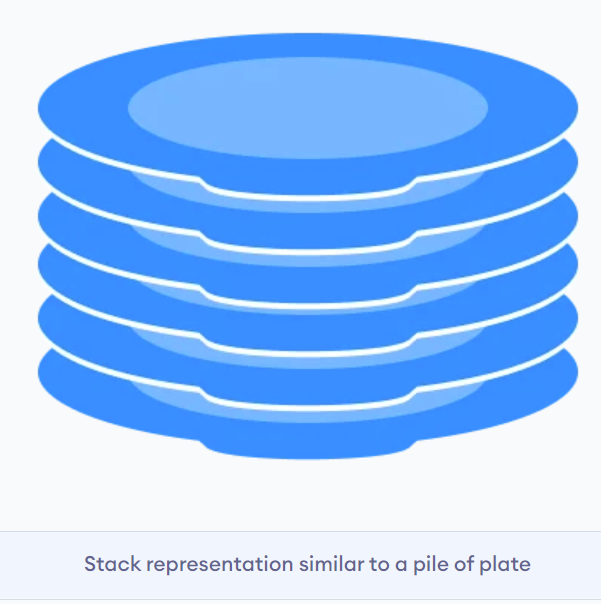
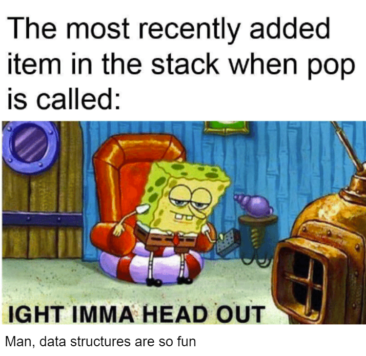
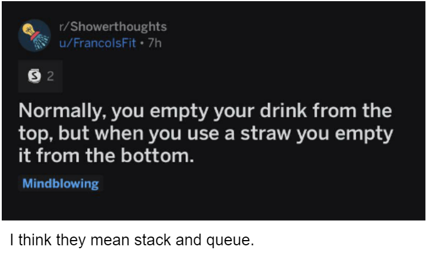
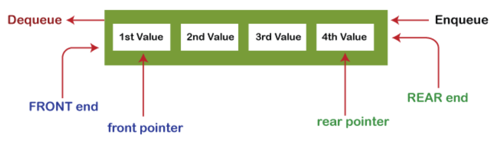

# Stacks, Queues

- [Stacks, Queues](#stacks-queues)
- [Stacks:](#stacks)
    - [Introduction:](#introduction)
    - [Stack Operations:](#stack-operations)
    - [Implementation of a Stack:](#implementation-of-a-stack)
    - [Working of Stack Operations:](#working-of-stack-operations)
    - [Time Complexity:](#time-complexity)
    - [Applications of Stack:](#applications-of-stack)
- [Queues:](#queues)
    - [Introduction:](#introduction-1)
    - [Queue Operations:](#queue-operations)
    - [Implementation of a Queue:](#implementation-of-a-queue)
    - [Working of Queue Operations:](#working-of-queue-operations)
    - [Time Complexity:](#time-complexity-1)
    - [Applications of Queue:](#applications-of-queue)

# Stacks:

### Introduction:

Stack is the first data structure that we're going to implement using a linked list. Stack is a linear data structure to store a collection of elements. It follows the **LIFO( Last In First Out)** principle. This just means that the last element inserted into a stack is the first one to be removed.

You can think of a stack as a pile of plates where the plate on the top of the pile is the last to be added and the first to be removed. Here you can either add a plate on top or remove the topmost plate. 



### Stack Operations:

Some of the operations we can perform on a stack are:

1. Push: Adds an element to the top of the stack.
2. Pop: Removes the topmost element of the stack. It can also be designed to return the topmost element along with removing it depending on your need.



  3. IsEmpty: Returns true if the stack is empty, else false.

  4. Top or Peek: Returns the top element of the stack without removing it from the stack.


### Implementation of a Stack:

Just like linked lists, the static implementation of a stack is just an array. We can easily perform the push, pop and top operation on an array and call it a stack. This method is not optimal as all the memory will have to be provided to the program at compile-time (as we will specify the maximum size of an array). 

A better implementation is the dynamic implementation of a stack using a single linked list. Here we can increase and decrease the size of the stack depending on our need and provide the memory to it accordingly.

### Working of Stack Operations:

Every stack has a node like a single linked list which stores a value and a pointer to the next element in the stack (the element below an element is the next element in a stack) . It also has a pointer top which points to the topmost element in the stack. (pointing to an element means that it points to a node which stores that element as its value)

- **Push**:                                                                                                                                                             Suppose we have a stack containing the elements 5 and 10 and we want to push 15 to it. Initial top element is 10. We create a new node to store the element 15 and make it point to the initial top element (initial top=next(15) ). We then change the final top element to be 15.
- **Pop**:                                                                                                                                                                        Now suppose we want to pop an element from the stack containing 5,10, and 15. Top initially is 15. We then change the final top to the 2nd element from the top of the stack, i.e. 10 (final top = next(initial top)=next(15)=10). Finally we delete the initial top element 15.

Here's the implementation of it in C++:

```cpp
#include <iostream>
using namespace std;

struct stack_node{ //same as a node in a linked list
	int val; //stores the value of the node in the stack
	stack_node* next; //points to the next element in the stack(element below it)
};

struct stack_node* top=nullptr; 
//initialise top as nullptr since there are 0 elements in stack 

void push(int elem){
	struct stack_node* temp= new stack_node(); 
  //creating a node for new element of stack
	temp->val=elem; 
	temp->next=top; 
	//the next element after temp(element just below temp) in stack is the initial top of stack
	top=temp; 
	//making temp as new top of stack
	
	cout<<"You pushed "<<elem<<endl;
}

bool isEmpty(){
	if(top==nullptr) { //top is nullptr implies there are 0 elements in stack
	  cout<<"Stack is empty\n";
	  return true;
  }
	else{ 
	  cout<<"Stack is not empty\n";
    return false;
  }
}

void pop(){

	if(top==nullptr){
		cout<<"Stack Underflow"<<endl; //0 elements in stack so cannot pop
		return;
	}

	int pop_val=top->val; //popped value is the value of current top element of stack
	
	struct stack_node* temp= top; //creating a temporary node to store top
	top=top->next; 
	//making the 2nd element from top(next element after top) as the new top after popping
	delete temp; //freeing up the memory of temporary node
	
	cout<<pop_val<<" was popped"<<endl;
}

int peek(){
	if(top==nullptr){ //0 elements in stack so there is no top element
		cout<<"Stack Underflow"<<endl;
	}
  else return top->val; //returns topmost element.
}

int main(){
	push(5);
	push(15);
	cout<<"Current top element is "<<peek()<<endl;
	pop();
	cout<<"Current top element is "<<peek()<<endl;
	pop();
	isEmpty();
	pop(); //gives stack underflow as there are no elements left in stack.
}
```

Output:

You pushed 5
You pushed 15
Current top element is 15
15 was popped
Current top element is 5
5 was popped
Stack is empty
Stack Underflow

We can see that the element added last to the stack is removed first. Also, we get an underflow error if we try to pop an element from empty stack.

### Time Complexity:

All the operations in a stack have a time complexity of O(1) as no loops are involved.                           Note: If you want to get the bottom element of a stack you will have to pop all the elements of the stack above it leading to an effective time complexity of O(n). 

### Applications of Stack:

- Reversing: If we want to reverse a string, we will put all it's characters in a stack and pop them out to get the reversed string.
- Backtracking: This is an algorithm which tries to solve a problem by trying out a path, and if that path is not efficient we go back to the previous state using the pop operation and try some other paths, for example in a maze. Thus, each time a path is chosen it is added to the stack.
- Undo: It is used in editors to implement the undo functionality where the state of the program is pushed to a stack every time a change is made. To undo a change, we just pop it out of the stack.

Questions to try out based on stacks:

1. Try designing a stack which returns the minimum element in the stack in constant time ( O(1) ). The performance of other operations like pop, push, etc. should not be affected.
2. Convert a given infix expression into a postfix expression. This is needed because a compiler reads an expression from left to right or right to left.                                                                         For example:                                                                                                                                                   Infix- A×B+C , Postfix- AB×C+                                                                                                                        Infix- A×(B×C+D×E)+F, Postfix- ABC×DE×+×F+                                                                                           Infix- (A+B)×C+(D-E)/F+G, Postfix- AB+C×DE-F/+G+                                                                                         Refer to this link if you want to understand what infix and postfix expressions are-[http://www.cs.man.ac.uk/~pjj/cs2121/fix.html](http://www.cs.man.ac.uk/~pjj/cs2121/fix.html)

# Queues:

### Introduction:

Queue is also a linear data structure which stores a collection of elements. It follows the **FIFO(First In First Out)** principle. Thus, it is different from stack in the way that in stack we remove the item which was most recently added, while in queue we remove the item which was least recently added (the first item). This creates some interesting applications for queues differing from those of stacks and we'll learn about them soon.

You can think of queue data structure as a ticket queue outside a railway station, where the first person to enter the queue was also the first person which got the ticket and was removed from the queue.



### Queue Operations:

The different operations we can perform on a queue are:

1. Enqueue: Adds an element to the rear of the queue.
2. Dequeue: Removes an element from the front of the queue. We can modify it to return the value of that element as well as per our need.
3. IsEmpty: Returns true if the queue is empty.
4. Peek: Returns the value of the front of the queue without removing it.



### Implementation of a Queue:

Similar to stack, queue can be implemented in a static and dynamic fashion. A static queue is an array of fixed size where we can perform operations enqueue, dequeue, etc. Like stacks, a dynamic queue is also a queue whose size can we varied and it is implemented using linked lists. Instead of an element top in stack, there are two elements front and rear signifying the ends of the queue.

### Working of Queue Operations:

Every queue has a node which stores a value and a pointer to the next element in the queue. It also has the pointers front and rear which point to the first and last element in the queue. (pointing to an element means that it points to a node which stores that element as its value.)

- Enqueue:                                                                                                                                                      Suppose there are elements 5 and 10 in a queue and we want to enqueue 15 to that queue. Initial front element is 5 and rear is 10. We create a new node to store the element 15 and make the rear element 10 point to it(next(rear)=next(10)=15). We then change the final rear element to 15 (final rear=next(initial rear)=next(10)=15).
- Dequeue:                                                                                                                                                             Now suppose we want to dequeue from the queue containing 5, 10 and 15. Initial front element is 5 and rear is 15.  We simply change the front element to the 2nd element in the list-10 (final front= next(initial front) =next(5)=10). Finally we delete the node which stores the initial front element 5.

Here is an implementation of it in C++

```cpp
#include<iostream>
using namespace std;

struct queue_node{ //same as a node in a stack/linked list
    int val;
    queue_node* next;
};

struct queue_node* front=nullptr, *rear=nullptr; 
//initialise front and rear to nullptr as there as 0 elements in queue

void enQueue(int elem){

    struct queue_node*temp= new queue_node(); 
		//create a node for new element of queue
    temp->val=elem; 
    temp->next=nullptr; 
		//There is no element after temp so next(temp) is nullptr

    if(rear==nullptr){
        front=rear=temp; 
				//if there are 0 elements in queue, 
				//both front and rear equal to the 1st element in queue
    }
    else{
        rear->next=temp; 
				//the element after the initial rear of the queue is the new element temp
        rear=temp; 
				//temp is the new rear of the queue as it is the last element
    }

    cout<<elem<<" was added to queue"<<endl;
    return;
}

void deQueue(){
    if(front==nullptr){ //implies queue is empty
        cout<<"Queue underflow"<<endl; //cannot remove an element from empty queue
        return;
    }

    struct queue_node* temp= front; 
		//creating a temporary node to store initial front 
    int return_val=front->val; 
		//front value is popped
    front=front->next; 
		//making the 2nd element from front of queue as new front after 1st element is removed
    delete temp; 
		//deleting temporary node to free up memory 

    if(front==nullptr){
        rear=nullptr; //0 elements in queue
    }
    
    cout<<return_val<<" was removed from queue"<<endl;
}

int peek(){
    if(front==nullptr){
        cout<<"Queue underflow"<<endl; //0 elements in queue
    }
    else return front->val; //returning value at front of queue
}

bool isEmpty(){
    if(front==NULL){
        cout<<"Queue is empty"<<endl;
        return true;
    }
    else {
        cout<<"Queue is not empty"<<endl;
        return false;
    }
}

int main(){
    enQueue(10);
    enQueue(5);
    cout<<"Element at front of queue is "<<peek()<<endl;
    deQueue();
    cout<<"Element at front of queue is "<<peek()<<endl;
    deQueue();
    isEmpty();
    deQueue();
}
```

Output:

10 was added to queue
5 was added to queue
Element at front of queue is 10
10 was removed from queue
Element at front of queue is 5
5 was removed from queue
Queue is empty
Queue underflow

Thus, the element which was added first to the queue is also removed first. Also we get an underflow error when we try to remove an element from an empty queue.

### Time Complexity:

All the operations in a queue have a constant time complexity of O(1) as no loops are involved.                           Note: If you want to get the rear element of a queue you will have to remove all the elements of the queue above it leading to an effective time complexity of O(n). 

### Applications of Queue:

- When data is transferred asynchronously (data not necessarily received at same rate as sent) between two processes. Queue is used for synchronization. For example: IO Buffers, pipes, file IO, etc.
- Queues are used in case of printers or uploading images, where the first one to be entered is the first to be processed. Similarly, all kinds of customer service are designed using concept of queues.

Questions to try out based on queues:

1. A dequeue is a queue where we can add and remove elements from both ends of the queue. Try to implement a dequeue on your own.
2. Implement a stack using the queue data structure. The stack should support push and pop operations. You can use the enqueue and dequeue operations of a queue to implement them.      Bonus: You can try implementing a queue using the stack data structure. 

Here are some links where you can practice questions based on stacks and queues:

1. [https://codeforces.com/contest/5/problem/C](https://codeforces.com/contest/5/problem/C)
2. [https://leetcode.com/problems/symmetric-tree/](https://leetcode.com/problems/symmetric-tree/)
3. [https://www.hackerearth.com/practice/data-structures/queues/basics-of-queues/practice-problems/algorithm/weird-planet-2000a170/](https://www.hackerearth.com/practice/data-structures/queues/basics-of-queues/practice-problems/algorithm/weird-planet-2000a170/)
4. [https://www.spoj.com/problems/HISTOGRA/](https://www.spoj.com/problems/HISTOGRA/)
